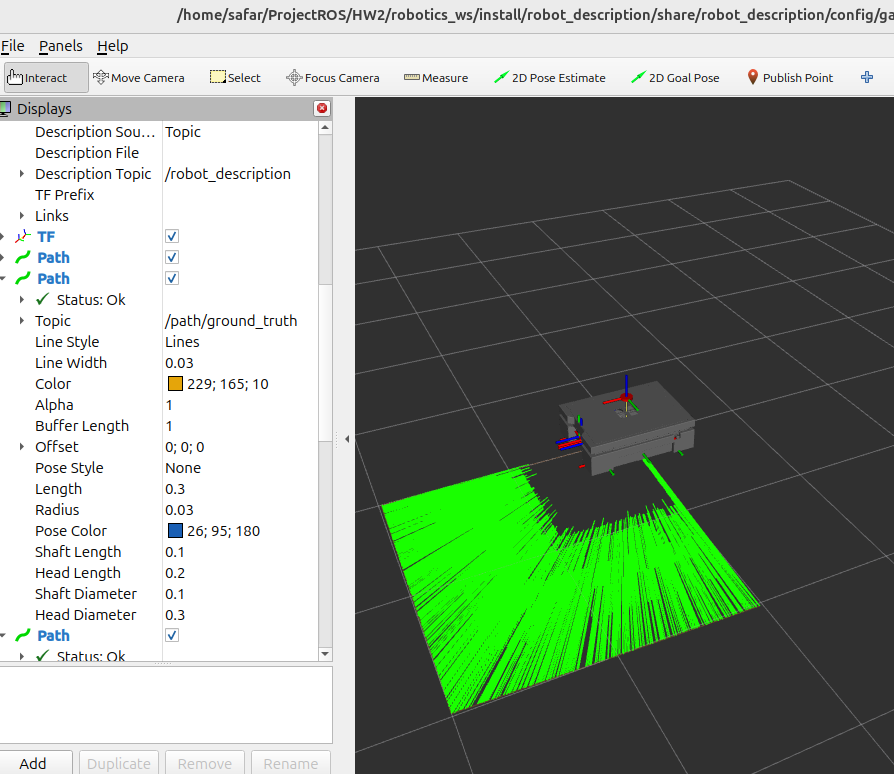
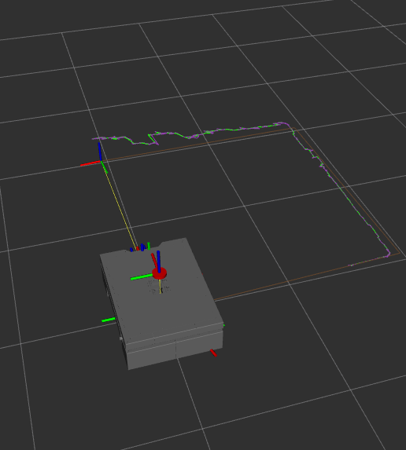
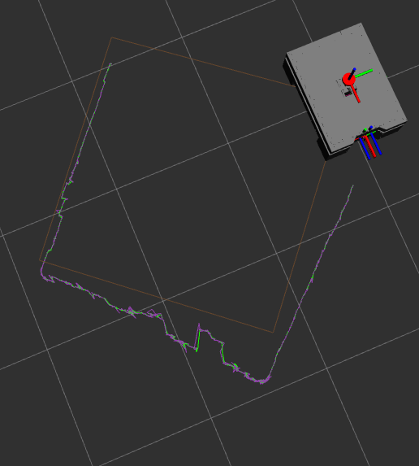

# Multi-Sensor Fusion & Robot Autonomy with Extended Kalman Filter (EKF)

This repository contains a full-stack **ROS 2** implementation of a localized autonomy system for a **auto_drive_ekf_robot**.  
The project demonstrates multi-sensor fusion using a custom-built **Extended Kalman Filter (EKF)** that combines a kinematic motion model with **IMU** and **Visual Odometry (VO)** data.


## System Architecture & Data Flow

The system is designed to **decouple hardware interfacing from autonomous estimation**.

### Data Paths

1. **Command Path**  
   `Test Node → /cmd_vel → Velocity Converter → Gazebo`

2. **Estimation Path**  
   `/cmd_vel → Prediction Node → EKF Node`

3. **Correction Path**  
   `IMU + Visual Odometry → Measurement Node → EKF Node`

---

##  Implementation Details

### 1. Prediction Model (`prediction_node.py`)

Implements **dead reckoning** by integrating commanded velocities over time to estimate the robot pose:

State: [ x , y , θ ]

#### Differential Drive Motion Model
xₜ₊₁ = xₜ + v · cos(θₜ) · dt  
yₜ₊₁ = yₜ + v · sin(θₜ) · dt  
θₜ₊₁ = θₜ + ω · dt


**Key Notes**
- Nonlinear kinematics
- Parameters (`wheel_radius`, `wheel_separation`) match the URDF
- Drift accumulates without sensor correction

---

### 2. Measurement Processing (`measurement_node.py`)

Pre-processes sensor data before EKF correction.

**Sensor Sources**
- IMU (orientation, angular velocity)
- ZED Visual Odometry (pose)

**Design Choices**
- **2D Constraint**  
z = 0  
roll = 0  
pitch = 0

- **Asynchronous synchronization**  
Measurement is published only when *both* IMU and VO are available.

Resulting measurement vector:
Z = [ x , y , θ ]

### 3. Extended Kalman Filter (`ekf_node.py`)

Implements the standard **predict → correct** EKF pipeline.

---

#### A. Prediction Step (Time Update)

Linearization is required due to nonlinear motion.

**State Jacobian (F)**

F =  
| 1 0 -v·sin(θ)·dt |  
| 0 1 v·cos(θ)·dt |  
| 0 0 1 |


**Covariance Propagation**

P = F · P · Fᵀ + Q


- `P`: state covariance
- `Q`: process noise (model uncertainty)

---

#### B. Correction Step (Measurement Update)

- Innovation: difference between predicted state and measurement
- Kalman Gain `K` balances sensor trust vs model trust

**Angle Normalization**

To avoid discontinuities at ±π:    θ = atan2( sin(θ), cos(θ) )


Where:
- `r` = wheel radius
- `L` = wheel separation
- Output unit = **rad/s** (Gazebo-compatible)

---

## Testing & Verification

The robot follows a **2.0 m × 2.0 m square trajectory**.

### Path Comparison

| Path Type        | Topic                    | Description                          |
|------------------|--------------------------|--------------------------------------|
| Ground Truth     | `/ground_truth/odom`     | Gazebo physics reference             |
| Motion Model     | `/odom_pred`             | Pure dead reckoning                  |
| Measurement      | `/measurement_model`     | Raw IMU + VO data                    |
| EKF Output       | `/ekf_odom`              | Final fused estimate                 |

The EKF trajectory should remain **closest to ground truth**.


**pure prediction in Rviz:**



**square path init:**


**final path and prediction:**



# **How to Run**

1.  **Clone and Build:**

```

mkdir -p ~/ros2_ws/src

cd ~/ros2_ws/src

git clone https://github.com/ampardra/auto_drive_ekf_robot.git

cd ..

colcon build 

source install/setup.bash
```
or zsh based on your shell.


2.  **Launch Simulation:**

```

ros2 launch robot_description gazebo.launch.py
```
  

3.  **Launch Localization Suite:**

```

ros2 launch robot_local_localization local_localization.launch.py
```
  

4.  **Visualize:**

Open RViz and add Path displays for /path/ekf, /path/ground_truth, and /path/prediction.
